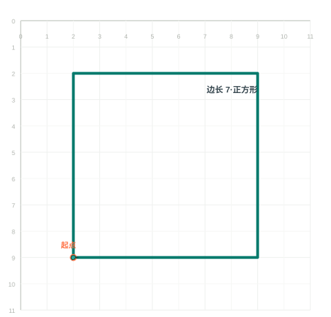
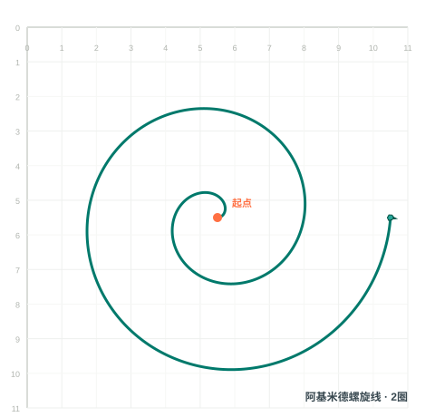
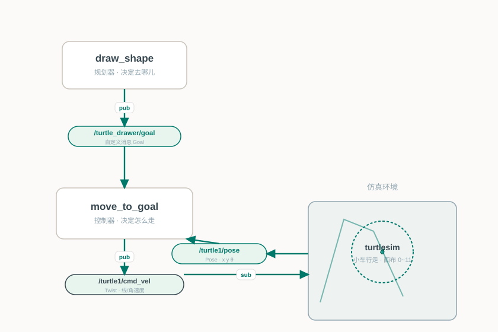

# 🐢 基于 ROS1 的自主绘图小车 (turtle_drawer)

一个在 **ROS1 (Noetic) turtlesim** 仿真环境中运行的"自主绘图小车"作业:

小车自动规划路径并行走,在画布上画出 **正方形**、**阿基米德螺旋线**。

> 课程:ROS 机器人系统 · 环境:Ubuntu 20.04 + ROS1 Noetic
>
> 体系分层:规划器(决定去哪) + 控制器(决定怎么走),通过**自定义消息**解耦 —— 覆盖 ROS1 核心知识点。

---

## 📑 目录

- [一、运行效果](#一运行效果)
- [二、系统架构](#二系统架构)
- [三、体现的 ROS1 知识点](#三体现的-ros1-知识点)
- [四、目录结构](#四目录结构)
- [五、环境准备](#五环境准备)
- [六、运行方式](#六运行方式)
- [七、可视化调试](#七可视化调试)
- [八、控制原理](#八控制原理)

---

## 一、运行效果

小车通过发布一串目标点并配合比例控制器,自动走出规则图形:

| 正方形 | 阿基米德螺旋线 |
| --- | --- |
|  |  |

*图为小车在 0~11 的画布上规划出的行走轨迹(起点为橙色圆点,绿色为路径,图中小海龟表示当前位置)。*

---

## 二、系统架构

整个系统遵循 **"规划器 — 控制器"** 的分层设计,并用自定义消息解耦各层:



数据流闭环:

```
draw_shape (规划器)
    │  pub: /turtle_drawer/goal          ← 决定小车"要去哪"
    ▼
[ Goal 话题 ]           (自定义消息,两个目标点坐标 x/y)
    │  sub
    ▼
move_to_goal (控制器)
    │  pub: /turtle1/cmd_vel             ← 决定小车"怎么走"
    ├─ sub: /turtle1/pose   需实时知道当前位姿
    ▼
turtlesim (仿真画布) ──── pub /turtle1/pose ────▶ 反馈给控制器
```

- **规划器 `draw_shape`**:按图形几何关系,依次计算并发布一串路径点 → `/turtle_drawer/goal`。
- **控制器 `move_to_goal`**:订阅目标点 + 当前位姿,用比例(P)控制算出速度 → `/turtle1/cmd_vel`。
- 两者通过**自定义消息**相连,互不关心对方内部实现,是 ROS1 典型的协作模式。

---

## 三、体现的 ROS1 知识点

| 知识点 | 对应实现 |
| --- | --- |
| 工作空间 / catkin 编译 | `CMakeLists.txt` + `catkin_make` |
| 自定义消息 | `msg/Goal.msg`(`x`、`y` 两个 float32 字段) |
| 发布者 / 订阅者 | 控制器订阅 pose、发布 cmd_vel;规划器发布 goal |
| 话题通信 | `/turtle1/pose`、`/turtle1/cmd_vel`、`/turtle_drawer/goal` |
| 控制算法 | 经典比例(P)控制器 + 角度归一化 |
| launch 文件 | `launch/demo.launch` 一键启动全部节点 |

---

## 四、目录结构

```
turtle_drawer/
├── package.xml              # 包清单(声明依赖与消息)
├── CMakeLists.txt           # 编译脚本(声明 Goal 消息、安装 python 脚本)
├── msg/
│   └── Goal.msg             # 自定义消息:目标位置
├── scripts/
│   ├── move_to_goal.py      # 控制器:订阅位姿 → 规划速度
│   └── draw_shape.py        # 规划器:发布一串目标点组成图形
├── launch/
│   └── demo.launch          # 一键启动脚本
└── README.md
```

---

## 五、环境准备

> 在 Ubuntu 20.04 虚拟机中,需先装好 ROS1 Noetic。

```bash
# 1. 创建并编译工作空间
mkdir -p ~/catkin_ws/src
cp -r <本包所在目录>/turtle_drawer ~/catkin_ws/src/

#    回到工作空间根目录
cd ~/catkin_ws
#    第一次编译需要
#    source /opt/ros/noetic/setup.bash
catkin_make

# 2. 让新消息立即可用(每次新开终端都要执行)
source devel/setup.bash
```

---

## 六、运行方式

**方式 A:一键 launch(推荐演示)**

```bash
source devel/setup.bash
roslaunch turtle_drawer demo.launch                 # 默认画螺旋线
roslaunch turtle_drawer demo.launch shape:=square   # 画正方形
```

**方式 B:分步运行(便于讲解每个节点)**

```bash
source devel/setup.bash

# 终端1:启动 turtlesim 画布
rosrun turtlesim turtlesim_node

# 终端2:启动控制器
rosrun turtle_drawer move_to_goal.py

# 终端3:启动规划器(画螺旋线或正方形)
rosrun turtle_drawer draw_shape.py spiral
rosrun turtle_drawer draw_shape.py square
```

---

## 七、可视化调试(演示加分项)

另开终端:

```bash
rqt_graph          # 查看各节点/话题的通信关系图
rostopic echo /turtle1/pose        # 实时查看小车位姿
rostopic echo /turtle_drawer/goal  # 查看规划器发的目标点
rosrun rqt_plot rqt_plot /turtle1/pose/x /turtle1/pose/y   # 绘制轨迹曲线
```

---

## 八、控制原理(答辩可用)

控制器每个周期(50 Hz)做三件事:

1. **取向**:计算到目标的方向角 `angle_goal = atan2(gy-y, gx-x)`,求得与当前朝向的偏差 `e_θ`;
2. **转向**:角速度 `z = Kp_ang * e_θ`(比例控制,偏差越大转得越快);
3. **前进**:线速度 `x = Kp_lin * dist`,且当 `|e_θ|` 很大时自动减速,避免车头还没转过来就冲过去(过冲)。

**到达判定**:`dist < 0.05` 且 `|e_θ| < 0.02` 即认为到达,速度归零。

角度做了归一化到 `[-π, π]`,避免角度跳变导致小车反向绕圈。

---

*本项目为课程作业,代码与文档供学习参考。*